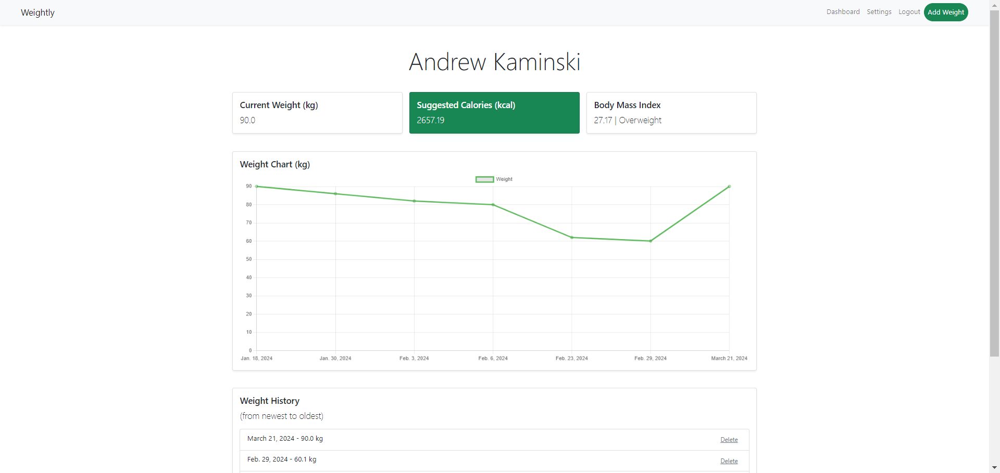

# Weightly (in progress)
### Screenshot

### Description
Weightly is an application that allows users to effortlessly archive and facilitate changes related to their body mass.
### Tech stack
- Django
- Chart.js
- Bootstrap 5

### Installation
```powershell
./venv/Scripts/activate
```

```powershell
cd weightly
```

```powershell
python -m manage runserver
```

```powershell
start http://127.0.0.1:8000/
```

### Passwords
- admin
  - login: weightlyadmin
  - password: 123
- test user
  - login: test
  - password: tester12345

